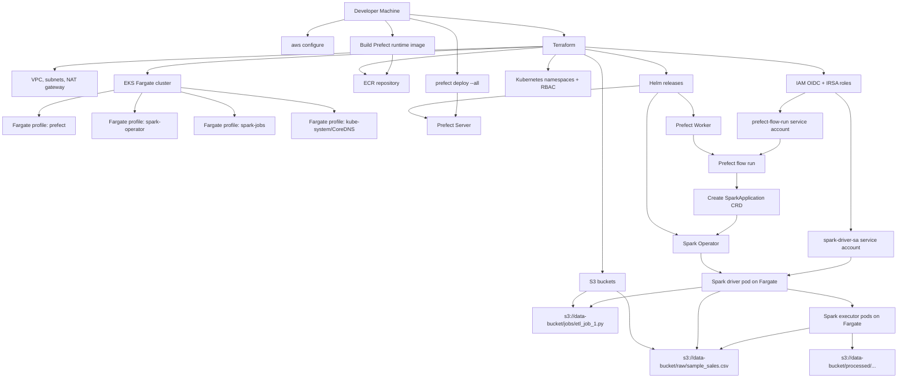

# Prefect + Spark on AWS EKS

Demo project for running a self-hosted Prefect deployment and Spark jobs on AWS EKS Fargate. Terraform provisions the AWS and Kubernetes infrastructure; Prefect orchestrates the ETL flow; Spark Operator runs the PySpark job on EKS.

## Deployment Flow



## Runtime Sequence

1. Configure AWS credentials with `aws configure`.
2. Run Terraform from `terraform/` to create EKS, Fargate profiles, S3, ECR, IRSA, Kubernetes RBAC, Prefect, and Spark Operator.
3. Terraform or `scripts/upload-spark-job-to-s3.sh` uploads `jobs/*.py` to S3.
4. Build and push the Prefect runtime image to ECR.
5. Run `prefect deploy --all` through `scripts/prefect-selfhosted-deploy.sh`.
6. Start a Prefect deployment manually, or run the demo event emitter deployment.
7. Prefect Worker creates a Kubernetes job for the flow run.
8. The flow reads `spark-job-config.yaml`, applies the selected job config to `spark-job.yaml`, and creates a complete SparkApplication manifest.
9. The flow submits the SparkApplication custom resource in the `spark-jobs` namespace.
10. Spark Operator creates Spark driver and executor pods on EKS Fargate.
11. Spark reads raw data from S3 and writes processed Parquet output back to S3.

## Spark Job Template

`spark-job.yaml` is a reusable SparkApplication template. Job-specific values live in `spark-job-config.yaml`.

To render a complete manifest locally:

```bash
python scripts/render-spark-application.py \
  --job-name etl_job_1 \
  --s3-bucket prefect-demo-data \
  --spark-app-name demo-etl-job \
  --output .generated/spark-application.yaml
```

The Prefect flow performs the same rendering step before submitting the SparkApplication to Kubernetes.

## Event Trigger Demo

The project includes two Prefect deployments:

- `eks-spark-s3-demo`: main ETL deployment that submits the Spark job.
- `emit-spark-etl-event`: demo deployment that emits the event `prefect-spark-eks.raw-data.ready`.

When `emit-spark-etl-event` runs, Prefect receives the event and triggers `eks-spark-s3-demo` automatically.

## Main Commands

```bash
cd terraform
cp terraform.tfvars.example terraform.tfvars
terraform init
terraform apply
```

```bash
aws eks update-kubeconfig --name prefect-spark-demo --region ap-southeast-1
bash scripts/ecr-push-prefect-runtime.sh
bash scripts/prefect-selfhosted-deploy.sh
```

See [terraform/README.md](terraform/README.md) for Terraform migration, import, and cleanup details.
